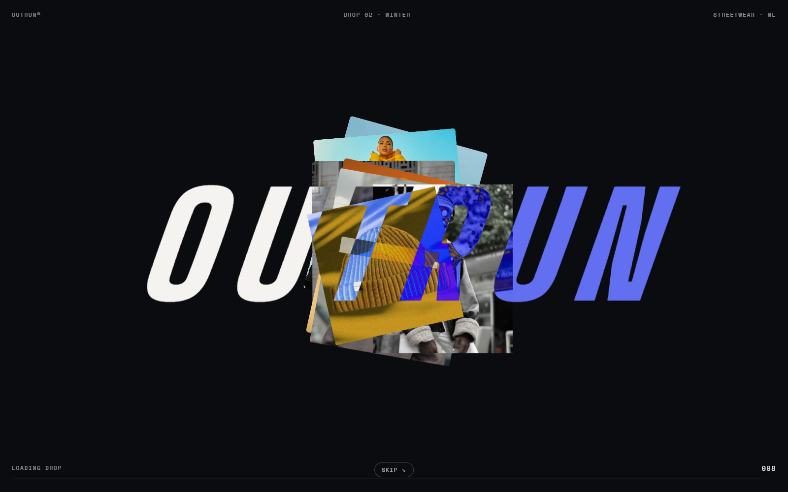
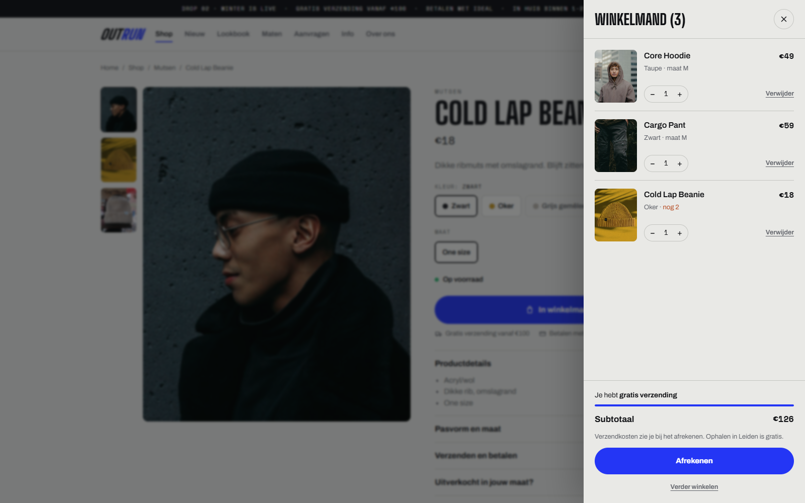
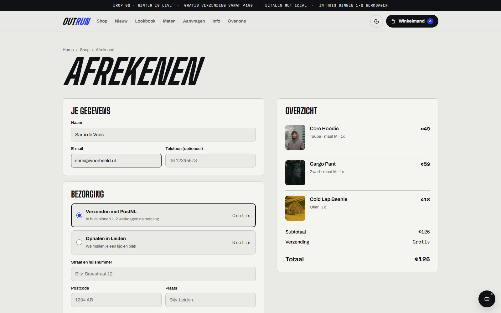
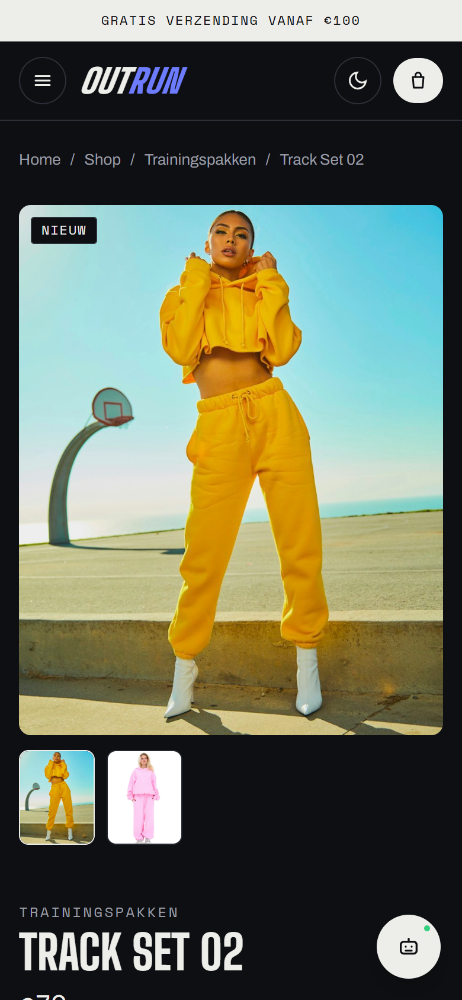

# OUTRUN

**Streetwear-webshop voor een eigen label: kleine drops, eerlijke prijzen, bestellen in een paar klikken.**



OUTRUN is een complete webshop zonder backend en zonder framework. Je kiest je maat, legt het in je winkelmand en rekent af. De bestelling komt binnen per mail en je betaalt met een iDEAL-betaalverzoek. Alles draait op statische HTML, CSS en JavaScript en is te hosten op GitHub Pages.

> Conceptproject. De productfoto's zijn stockfoto's van [Unsplash](https://unsplash.com) en tonen niet de echte OUTRUN-producten.


## Highlights

- **Startanimatie**: het logo husselt zich uit willekeurige tekens, productfoto's stapelen zich erachter op en daarna zoom je door het woord de site in
- **Bestellen via de site**: winkelmand in een uitschuiflade, afrekenen met verzenden of ophalen, bevestiging per mail
- **Voorraad per kleur en maat**: uitverkochte maten zijn doorgestreept, en labels als "Uitverkocht", "Bijna op", "Nieuw", "Binnenkort" en sale-percentages worden automatisch berekend
- **Eigen cursor**: een blob die uitrekt in de richting waarin je beweegt, om knoppen heen plakt en ze in kleur omkeert, en boven producten een "Bekijk →"-cirkel toont
- **Bewegend ontwerp**: vloeiend scrollen, koppen die woord voor woord in beeld schuiven, foto-reveals met parallax, een marquee die reageert op je scrollsnelheid en panelen die over het scherm vegen tussen pagina's
- **Chatbot** die maatadvies geeft op basis van je lengte en precies weet wat er per maat en kleur nog op voorraad is
- **Licht en donker**, responsive van telefoon tot breed scherm

## Screenshots

| Shop met hover | Product en chatbot |
| --- | --- |
|  |  |

| Winkelmand | Afrekenen |
| --- | --- |
|  |  |

| Mobiel | Mobiel, donker |
| --- | --- |
|  |  |

## Pagina's

| Pagina | Inhoud |
| --- | --- |
| `index.html` | Hero, categorieën, nieuwe items, "Binnenkort"-banner, laatste stuks |
| `shop.html` | Alle producten. Filter op categorie, maat, "Nieuw", "Sale" en "alleen op voorraad", met zoeken en sorteren. De filters staan in de URL. |
| `product.html?id=…` | Foto's per kleur, kleur- en maatkeuze, voorraadmelding, "In winkelmand", gerelateerde items |
| `afrekenen.html` | Gegevens, verzenden of ophalen, overzicht met verzendkosten, bedankpagina met bestelnummer |
| `lookbook.html` | Looks met links naar de producten die erin zitten |
| `maten.html` | Maattabellen en een maatcalculator |
| `aanvragen.html` | Iets aanvragen dat niet in de shop staat, met foto-upload |
| `info.html` | Veelgestelde vragen over bestellen, betalen, verzenden en ruilen |
| `over.html` | Het verhaal achter het merk |

## Zo werkt een bestelling

1. De klant legt items in de winkelmand. De winkelmand wordt in de browser bewaard, en je kunt nooit meer bestellen dan er op voorraad is.
2. Bij het afrekenen vult de klant naam, e-mail en adres in, of kiest voor gratis ophalen.
3. De bestelling gaat via [FormSubmit](https://formsubmit.co) naar het e-mailadres van de winkel. De klant krijgt automatisch een bevestiging met het bestelnummer.
4. De winkel stuurt een iDEAL-betaalverzoek en verstuurt na betaling.

## Techniek

- HTML, CSS en vanilla JavaScript, zonder build-stap
- [Lenis](https://github.com/darkroomengineering/lenis) voor vloeiend scrollen, via jsDelivr (zonder Lenis scrolt de site gewoon normaal)
- Lettertypes: Big Shoulders Display, Archivo en Space Mono via Google Fonts
- Met `prefers-reduced-motion` staan alle animaties, het vloeiend scrollen en de eigen cursor uit

```
assets/
  data.js      instellingen, producten en lookbook
  site.js      header, footer, winkelmand, productkaarten, voorraadlogica
  motion.js    startanimatie, pagina-overgangen, scroll-animaties, cursor
  chatbot.js   de chatbot
  style.css    alle styling
img/           productfoto's
docs/          screenshots voor deze README
```

## Lokaal draaien

```
python -m http.server
```

Open daarna `http://localhost:8000`.

## Aanpassen

Alles staat in `assets/data.js`:

- **`CONFIG`**: het e-mailadres waar bestellingen binnenkomen, verzendkosten, gratis verzending vanaf, ophaalplaats, naam van de drop en Snapchat (voor contact)
- **`PRODUCTS`**: per product een naam, categorie en prijs, optioneel `was` (oude prijs), `isNew` of `soon`, en per kleur een foto en de voorraad per maat. Zet een maat op `0` en die is uitverkocht.
- **`LOOKS`**: de foto's in het lookbook en de producten die erbij horen

Bij de eerste bestelling vraagt FormSubmit om het e-mailadres te activeren via een link in de mail. De voorraad in `data.js` gaat niet automatisch omlaag na een bestelling. Die pas je zelf aan.

---

Gemaakt door Omar Moussaten.
