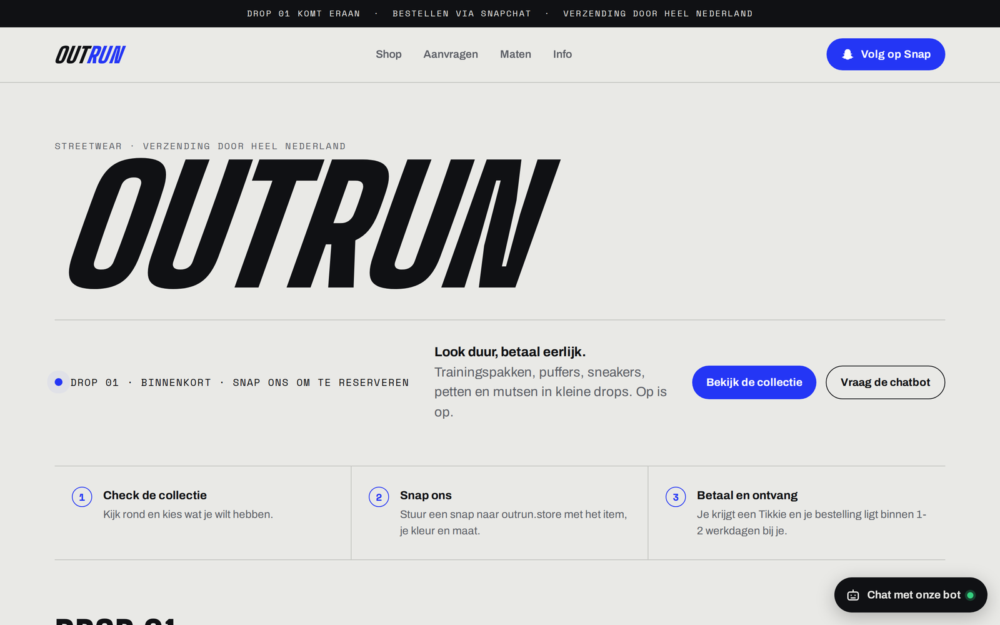
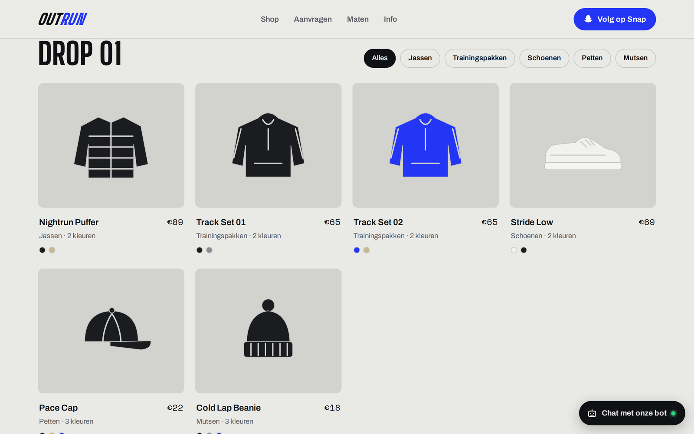
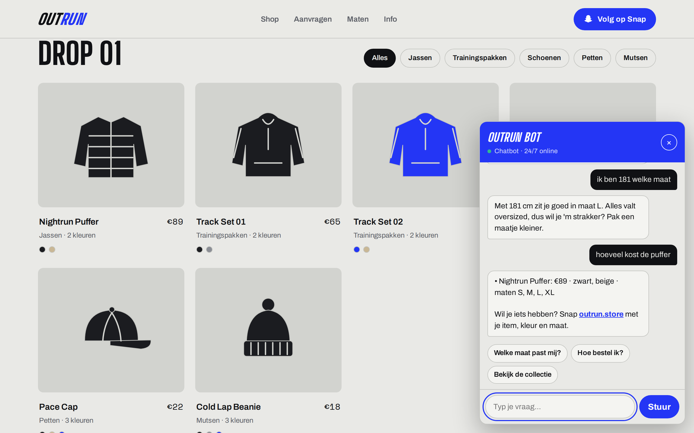
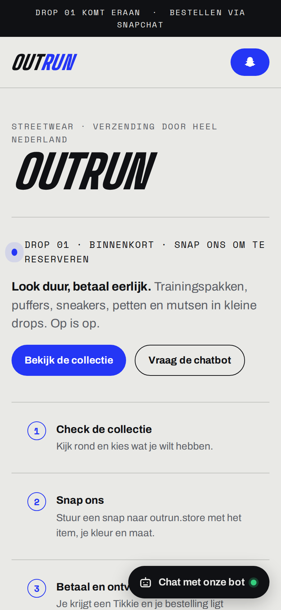

# OUTRUN – Streetwear webshop (concept)

Conceptwebsite voor **OUTRUN**, een eigen streetwear-label dat via Snapchat verkoopt. De site laat de collectie zien, beantwoordt vragen met een chatbot en neemt aanvragen aan met foto's. Alles draait zonder backend of framework, in één `index.html`.

> Dit is een conceptproject. De site staat niet (meer) live.

## Features

- **Productcatalogus** met filters per categorie, een productvenster met kleurwissel en een voorbeeld per kleur
- **Chatbot** (regelgebaseerd, geen externe API) die intenties herkent (maat, prijs, verzending, ophalen, betalen, aanvragen). Hij geeft maatadvies op basis van lichaamslengte en haalt prijzen en maten live uit de productdata.
- **Aanvraagformulier** met foto-upload (max. 3, voorbeelden en validatie van de bestandsgrootte), verstuurd via [FormSubmit](https://formsubmit.co) naar e-mail
- **"Binnenkort"-status** en **productfoto's** per product of per kleur, in te stellen met één veld
- **Responsive** van telefoon tot desktop, met **light en dark mode** via CSS-variabelen
- **Toegankelijk**: toetsenbordfocus, `aria`-labels, Escape sluit vensters, en `prefers-reduced-motion` wordt gerespecteerd

| Collectie | Chatbot | Mobiel |
| --- | --- | --- |
|  |  |  |

## Techniek

- HTML, CSS en vanilla JavaScript, zonder build-stap en zonder dependencies
- Productillustraties als inline SVG, gegenereerd vanuit de productdata
- Configuratie op één plek (`CONFIG` en `PRODUCTS` in `index.html`)
- Hosting getest op GitHub Pages

## Lokaal bekijken

Open `index.html` in je browser. Er hoeft niets geïnstalleerd te worden.

## Aanpassen

In het `<script>`-blok van `index.html`:

- `CONFIG`: Snapchat-naam, naam van de drop, e-mailadres voor aanvragen
- `PRODUCTS`: producten met naam, categorie, prijs, kleuren, maten en optioneel `img` en `soon: true`

---

Gemaakt door Omar Moussaten.
